  

  <i>I build for the web, and I learn the machine running underneath it.</i>

 

<h3 align="center">Now</h3>

  Software engineering at <b>42 Paris</b>. Shipping web apps, writing C close to the metal, 
  and treating every project as a reason to learn the next layer down.

 

<h3 align="center">Stack</h3>

  <code>C</code> &nbsp;·&nbsp; <code>C++</code> &nbsp;·&nbsp; <code>Python</code> 
  <code>Next.js</code> &nbsp;·&nbsp; <code>TypeScript</code> &nbsp;·&nbsp; <code>Tailwind</code> &nbsp;·&nbsp; <code>Django</code> 
  <code>PostgreSQL</code> &nbsp;·&nbsp; <code>MySQL</code> &nbsp;·&nbsp; <code>Docker</code> &nbsp;·&nbsp; <code>Git</code>

 

<h3 align="center">Signal</h3>

  
  &nbsp;&nbsp;
  

 

  
  &nbsp;
  
  &nbsp;
  
  &nbsp;
  

  <i>github.com/elopin42</i>

